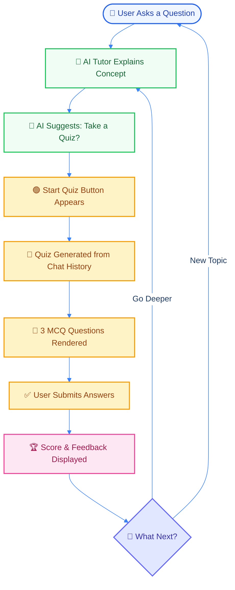

# Recall AI Agent | SFA Pro 🎓

A high-performance, minimalist AI study agent built with the **Single-File Architecture (SFA)** philosophy. This project rejects complex frontend frameworks in favor of ultra-fast, zero-dependency vanilla HTML/JS paired with a robust **FastAPI-LangChain** backend.

## 🧬 Design Philosophy: SFA

Inspired by the engineering simplicity advocated by developers like Simon Willison, this project uses a "Single-File Frontend."

- **LLM-Friendly**: Pure HTML/Javascript is remarkably easy for AI to assist with and debug.
- **Ultra-Lightweight**: No heavy JS bundles or build steps.
- **Portability**: One file (`index.html`) contains the entire UI, logic, and styling.
- **FastAPI Backend**: A high-performance Python backend serving the SFA frontend.

## 💡 Inspiration

**Inspired by ChatGPT's Study Mode**, but with a powerful twist. While ChatGPT study mode focuses on long-form explanations, Recall AI Agent implements **immediate feedback loops**. After each lesson, you get a **quick quiz on what you just learned**—reinforcing knowledge in real-time and preventing hallucinations by keeping quizzes contextual to your actual conversation history.

## 📊 How It Works



## 🧠 Core Features

- **Teach-then-Test Workflow**: The AI focuses on teaching technical topics before suggesting interactive assessments.
- **Contextual Quizzes**: Quizzes are generated dynamically based *only* on the previous chat history to prevent hallucinations.
- **Performance UI**:
  - **Syntax Highlighting**: Beautifully formatted code blocks using `highlight.js`.
  - **Session Persistence**: Your study progress is saved to `LocalStorage` automatically.
  - **Premium Interaction**: Responsive, real-time feedback with zero page refreshes.

## 🚀 Getting Started

### 1. Prerequisites

- Python 3.12+
- A Groq API Key (saved in `.env`)
- `uv` (Fast Python package manager)

### 2. Installation

```bash
# Install dependencies using uv
uv sync
```

### 3. Running the App

```bash
# Run the FastAPI server
uv run python main.py
```

After starting, open your browser and go to:
**[http://localhost:8080](http://localhost:8080)**

## 🐳 Docker Deployment

```bash
# Build the image (for Docker Hub)
docker build -t farhanrhine/recall-ai-agent-gcp:latest .

# Run the container (for production)
docker run -p 8080:8080 --env-file .env farhanrhine/recall-ai-agent-gcp:latest
```

## 📂 Project Structure

```
recall-ai-agent-gcp/
├── index.html                 # Single-file frontend
├── main.py                    # FastAPI entry point
├── pyproject.toml             # Dependencies (Python 3.12+)
├── Dockerfile                 # Container setup
├── Jenkinsfile                # CI/CD pipeline
├── src/
│   ├── agent/                 # AI agent logic
│   │   ├── companion.py       # Chat & quiz generation
│   │   └── tools.py           # LLM tool definitions
│   ├── llm/                   # LLM integration
│   │   └── groq_client.py     # Groq API client
│   ├── models/                # Data schemas
│   │   └── schemas.py         # Pydantic models
│   ├── prompts/               # System prompts
│   │   └── templates.py       # Prompt templates
│   ├── config/                # Configuration
│   │   └── settings.py        # Environment settings
│   ├── common/                # Utilities
│   │   ├── logger.py          # Logging setup
│   │   └── custom_exception.py
│   └── utils/
│       └── helpers.py         # Helper functions
├── manifests/                 # Kubernetes configs
│   ├── deployment.yaml
│   └── service.yaml
└── logs/                      # Application logs
```

## 🛠️ Tech Stack

- **Backend**: FastAPI, LangChain, Groq (LLaMA-3.1-8B)
- **Frontend**: Vanilla HTML5, CSS3, JavaScript (ES6+)
- **Syntax Highlighting**: highlight.js, marked.js
- **Package Management**: `uv` (ultra-fast Python package manager)
- **Containerization**: Docker
- **Orchestration**: Kubernetes (Minikube)
- **CI/CD**: Jenkins, Argo CD

## 📋 API Endpoints

- `POST /api/chat` - Chat with the AI tutor
- `POST /api/quiz` - Generate contextual quiz from history
- `GET /` - Serve the frontend

---
*Built by Farhan with focus on simplicity, speed, and engineering pragmatism.*
