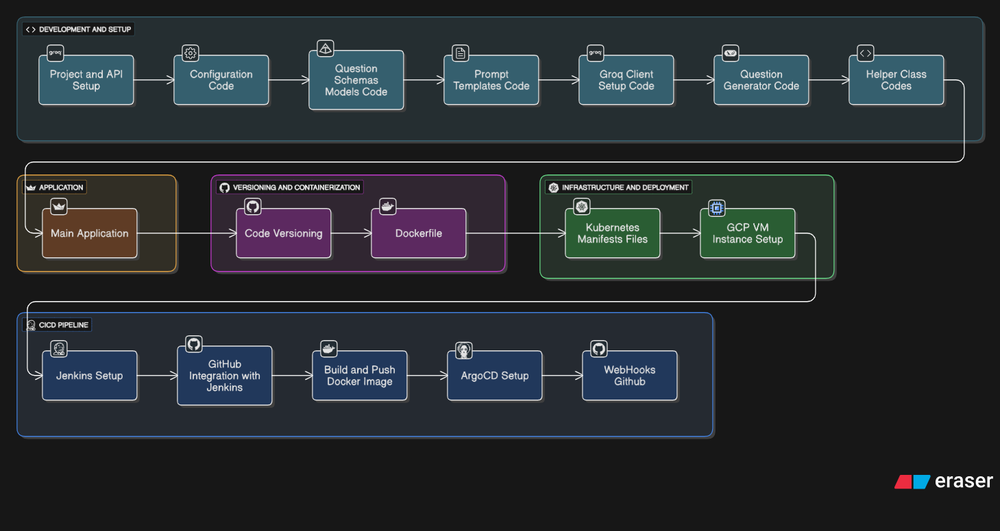

# 🎓 Study Buddy AI - Smart Quiz Generator

Study Buddy AI is an advanced, AI-powered educational tool designed to help students and educators generate high-quality quizzes on any topic instantly. Built with Python and Streamlit, it leverages the power of Large Language Models (LLMs) via Groq to create Multiple Choice Questions (MCQs) and Fill-in-the-Blank exercises.

## 🚀 Features

- **Instant Quiz Generation**: Enter any topic (e.g., "Quantum Physics", "World War II") and get a quiz in seconds.
- **Customizable Difficulty**: Choose between Easy, Medium, and Hard levels.
- **Question Types**: Support for Multiple Choice and Fill in the Blanks.
- **Real-time Evaluation**: Get instant feedback on your answers with explanations.
- **Export Results**: Download your quiz performance as a CSV file for tracking.
- **GitOps Integration**: Fully automated CI/CD pipeline using Jenkins, ArgoCD, and Kubernetes.

## 🛠️ Tech Stack

- **Frontend**: [Streamlit](https://streamlit.io/)
- **LLM Engine**: [Groq](https://groq.com/) (Llama 3.1 8B)
- **Containerization**: [Docker](https://www.docker.com/)
- **Orchestration**: [Kubernetes (Minikube)](https://kubernetes.io/)
- **CI/CD**: [Jenkins](https://www.jenkins.io/)
- **GitOps**: [ArgoCD](https://argoproj.github.io/cd/)
- **Infrastructure**: [Google Cloud Platform (GCP)](https://cloud.google.com/)

## 📂 Project Structure

```text
personal-study-ai-agent/
│
├── application.py          # Main Streamlit application
├── Dockerfile              # Containerization configuration
├── Jenkinsfile            # CI/CD pipeline definition
├── manifests/              # Kubernetes deployment & service YAMLs
│   ├── deployment.yaml
│   └── service.yaml
├── src/                    # Source code
│   ├── generator/          # Quiz generation logic
│   ├── llm/                # LLM client & API integration
│   ├── models/             # Data schemas (Pydantic)
│   ├── prompts/            # LLM prompt templates
│   └── utils/              # Helper functions & QuizManager
├── FULL_DOCUMENTATION.md   # Detailed setup and deployment guide
└── README.md               # Project overview
```

## 🏗️ Architecture & Workflow

The project follows a modern GitOps workflow:
1. **Developer** pushes code to GitHub.
2. **Jenkins** triggers a build, creates a Docker image, and pushes it to DockerHub.
3. **ArgoCD** detects changes in the `manifests/` directory and synchronizes the state with the **Kubernetes** cluster.



## 🚦 Getting Started

### Prerequisites

- Python 3.12+
- Groq API Key (add to `.env`)

### Local Installation

1. **Clone the repository**:
   ```bash
   git clone https://github.com/farhanrhine/personal-study-ai-agent.git
   cd personal-study-ai-agent
   ```

2. **Install dependencies**:
   ```bash
   pip install -e .
   ```

3. **Run the application**:
   ```bash
   streamlit run application.py
   ```

### Deployment

For detailed instructions on setting up Jenkins, ArgoCD, and Kubernetes on GCE, please refer to the [FULL_DOCUMENTATION.md](./FULL_DOCUMENTATION.md).

## 🛡️ License

This project is created for educational purposes. Feel free to use and modify it!

---
*Created with ❤️ by Farhan Rhine*
